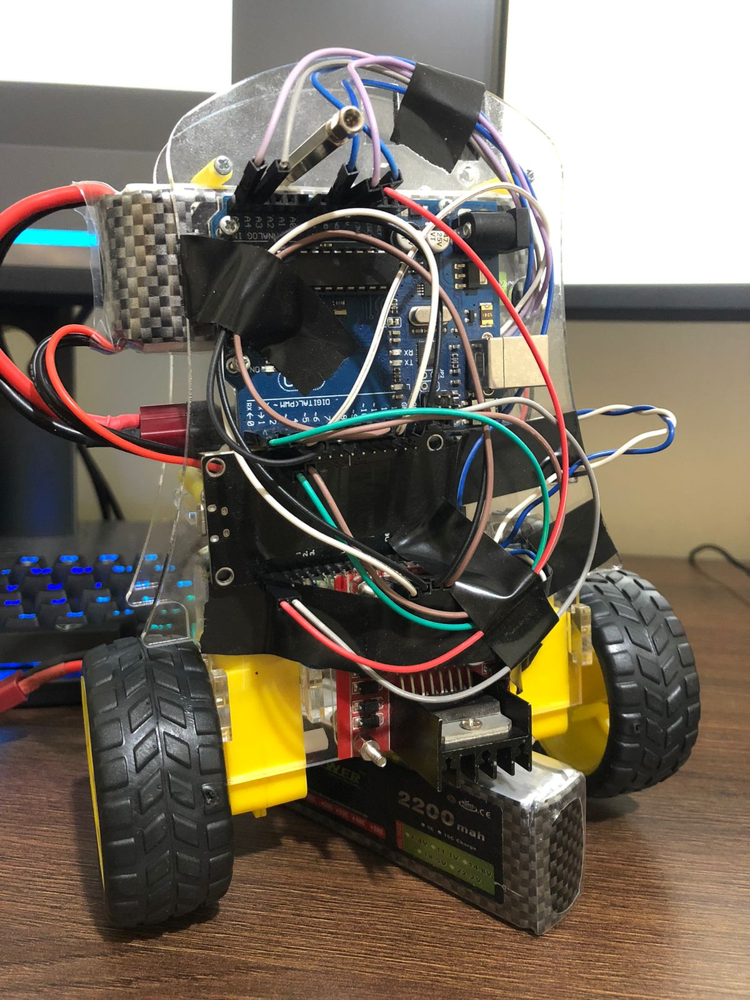
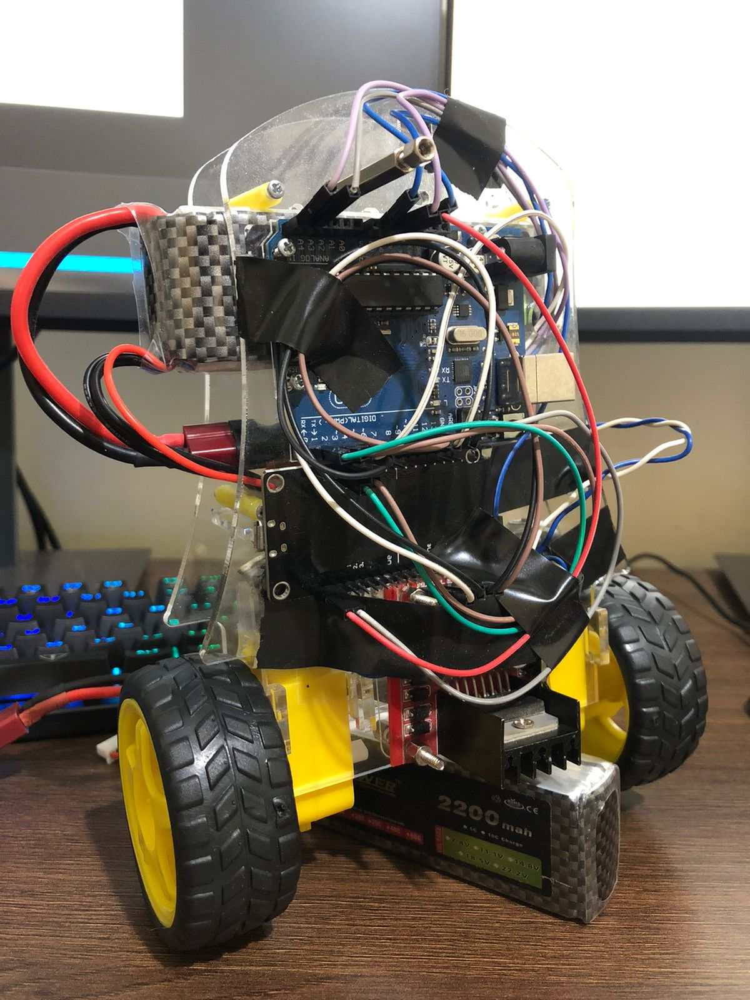

## Mechanical Details:
- Acrylic Chassis - 3mm
- Chassis Dimension: 13 x 16.5 cm
- 2 wheels

## Eletronics Details:
- 1x Arduino Uno
- 1x ESP8266
- 1x MPU6050
- 1x L298N Driver
- 1x LiPo battery 2200mah 5c 11.1v

## Programming Details:
- The data are transported from Arduino to Computer using USB. Feel free to use the ESP-01 or other Wi-Fi Microcontroller data-transporter.
- You can use the MQTT to read the ESP-01 / ESP8266 data and plot these values on software.

### Programming Details - Example of data-transporter (payload): 
```
{
   "measure":{
      "accx":-16040.00,
      "accy":316.00,
      "accz":-984.00,
      "gyrox":-324.00,
      "gyroy":-150.00,
      "gyroz":-84.00,
      "kalanglex":1.37,
      "kalangley":-86.54,
      "pitch":-86.31,
      "roll":1.13,
      "res":200.00,
      "kp":27.00,
      "kd":4.00,
      "ki":3.00
   }
}
```

## Self-Balancing robot:
- Total weight: 543g

## Photos:
<p align="center"></p>
<p align="center"></p>
<p align="center"></p>
<p align="center"></p>

## GIF - axis-self-balancing:
<p align="center"></p>