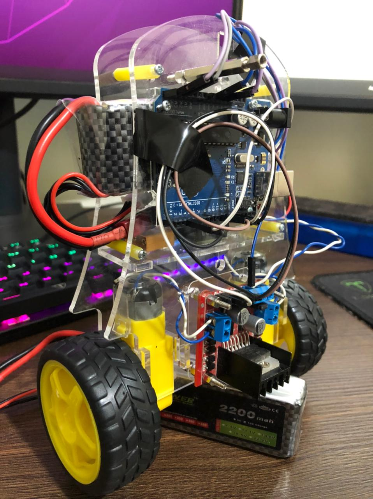
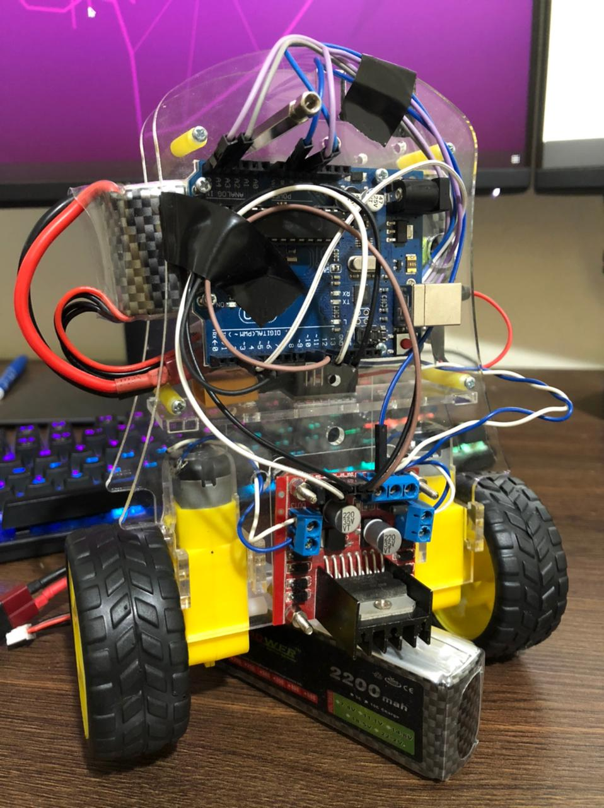

## Mechanical Details:
- Acrylic Chassis - 3mm
- Chassis Dimension: 13 x 16.5 cm
- 2 wheels

## Eletronics Details:
- 1x Arduino Uno
- 1x ESP8266
- 1x MPU6050
- 1x L298N Driver
- 1x LiPo battery 2200mah 5c 11.1v

## Programming Details:
- The data are transported from Arduino to Computer using USB. Feel free to use the ESP-01 or other Wi-Fi Microcontroller data-transporter
- You can use the MQTT to read the ESP-01 / ESP8266 data and plot these values on software

## Self-Balancing robot:
- Total weight: 543g

## Photos:

